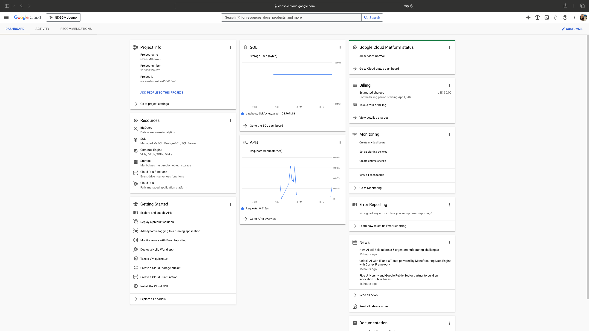
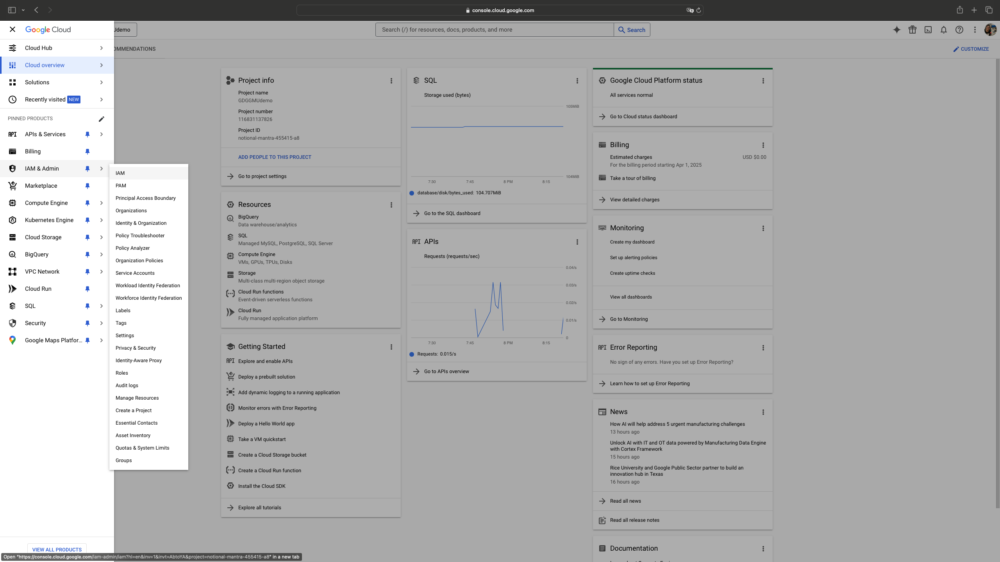
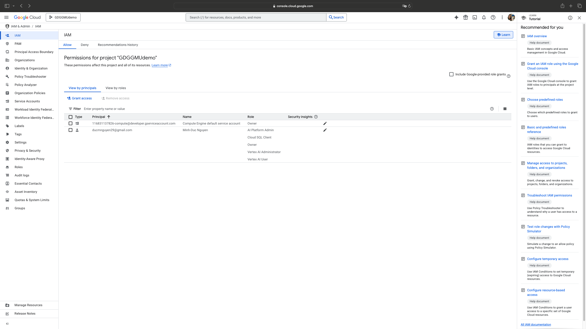

# Starting notes

## How to set up your project with Google Cloud services

## Create a Google Cloud account and check your Dashboard

- After you create the account, create a new project



- Then activate services like VertexAI, AI Platform, and Cloud SQL Client
- Check out the IAM and Admin page, where you need to authorize participants in your projects and allow their accesses to those tools. [READ MORE](https://cloud.google.com/iam/docs/understanding-roles?hl=en&_gl=1*1ioylta*_ga*MTI3MjI2ODEwNS4xNzI3OTgwMDc2*_ga_WH2QY8WWF5*MTc0MzU2OTkxMi4yMi4wLjE3NDM1Njk5NjEuMTEuMC4w#predefined_roles)





## Install CLI and tools from Google Cloud
On your computer, create a virtual environment

```
python -m venv /path/to/new/virtual/environment

source /path/to/new/virtual/environment/bin/activate
```

From here, install google cloud services

```
pip install google-cloud-storage
pip install --upgrade google-cloud-aiplatform
pip install --upgrade google-genai     
```

You also need to log in to your Google Cloud account for credentials

```
gcloud auth application-default login
```

Check out our example "langchain_pgvector.ipynb" and other repositories on our github.